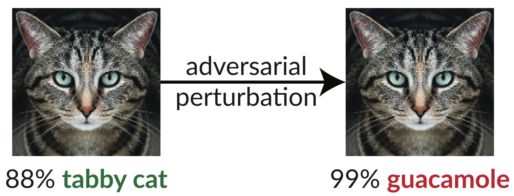

# Obfuscated Gradients Give a False Sense of Security: Circumventing Defenses to Adversarial Examples



Above is an [adversarial example](https://blog.openai.com/adversarial-example-research/): the slightly perturbed image of the cat fools an InceptionV3 classifier into classifying it as “guacamole”. Such “fooling images” are [easy to synthesize](http://www.anishathalye.com/2017/07/25/synthesizing-adversarial-examples/) using gradient descent ([Szegedy et al. 2013](https://arxiv.org/abs/1312.6199)).

In our recent paper, we evaluate the robustness of eight papers accepted to ICLR 2018 as non-certified white-box-secure defenses to adversarial examples. We find that seven of the eight defenses provide a limited increase in robustness and can be broken by improved attack techniques we develop.

Below is Table 1 from our paper, where we show the robustness of each accepted defense to the adversarial examples we can construct:

| Defense | Dataset | Distance | Accuracy |
|---|---|---|---|
| [Buckman et al. (2018)](https://openreview.net/forum?id=S18Su--CW) | CIFAR | 0.031 (linf) | 0%* |
| [Ma et al. (2018)](https://openreview.net/forum?id=B1gJ1L2aW) | CIFAR | 0.031 (linf) | 5% |
| [Guo et al. (2018)](https://openreview.net/forum?id=SyJ7ClWCb) | ImageNet | 0.005 (l2) | 0%* |
| [Dhillon et al. (2018)](https://openreview.net/forum?id=H1uR4GZRZ) | CIFAR | 0.031 (linf) | 0% |
| [Xie et al. (2018)](https://openreview.net/forum?id=Sk9yuql0Z) | ImageNet | 0.031 (linf) | 0%* |
| [Song et al. (2018)](https://openreview.net/forum?id=rJUYGxbCW) | CIFAR | 0.031 (linf) | 9%* |
| [Samangouei et al. (2018)](https://openreview.net/forum?id=BkJ3ibb0-) | MNIST | 0.005 (l2) | 55%** |
| [Madry et al. (2018)](https://openreview.net/forum?id=rJzIBfZAb) | CIFAR | 0.031 (linf) | 47% |
| [Na et al. (2018)](https://arxiv.org/abs/1708.02582) | CIFAR | 0.015 (linf) | 15% |

(Defenses denoted with * also propose combining adversarial training; we report here the defense alone. See our paper, Section 5 for full numbers. The fundemental principle behind the defense denoted with ** has 0% accuracy; in practice defense imperfections cause the theoretically optimal attack to fail, see Section 5.4.2 for details.)

The only defense we observe that significantly increases robustness to adversarial examples within the threat model proposed is “Towards Deep Learning Models Resistant to Adversarial Attacks” ([Madry et al. 2018](https://arxiv.org/abs/1706.06083)), and we were unable to defeat this defense without stepping outside the threat model. Even then, this technique has been shown to be difficult to scale to ImageNet-scale ([Kurakin et al. 2016](https://arxiv.org/abs/1611.01236)). The remainder of the papers rely either inadvertently or intentionally on what we call *obfuscated gradients*. Standard attacks apply gradient descent to maximize the loss of the network on a given image to generate an adversarial example on a neural network. Such optimization methods require a useful gradient signal to succeed. When a defense obfuscates gradients, it breaks this gradient signal and causes optimization based methods to fail.

We identify three ways in which defenses cause obfuscated gradients, and construct attacks to bypass each of these cases. Our attacks are generally applicable to any defense that includes, either intentionally or or unintentionally, a non-differentiable operation or otherwise prevents gradient signal from flowing through the network. We hope future work will be able to use our approaches to perform a more thorough security evaluation.

## Paper

**Abstract:**

We identify obfuscated gradients, a kind of gradient masking, as a phenomenon that leads to a false sense of security in defenses against adversarial examples. While defenses that cause obfuscated gradients appear to defeat iterative optimization-based attacks, we find defenses relying on this effect can be circumvented. For each of the three types of obfuscated gradients we discover, we describe characteristic behaviors of defenses exhibiting this effect and develop attack techniques to overcome it. In a case study, examining non-certified white-box-secure defenses at ICLR 2018, we find obfuscated gradients are a common occurrence, with 7 of 8 defenses relying on obfuscated gradients. Our new attacks successfully circumvent 6 completely and 1 partially.

For details, read our [paper](https://arxiv.org/abs/1802.00420).

## Source code

This repository contains our instantiations of the general attack techniques
described in our paper, breaking 7 of the ICLR 2018 defenses. Some of the
defenses didn't release source code (at the time we did this work), so we had
to reimplement them.

## Citation

```
@inproceedings{obfuscated-gradients,
  author = {Anish Athalye and Nicholas Carlini and David Wagner},
  title = {Obfuscated Gradients Give a False Sense of Security: Circumventing Defenses to Adversarial Examples},
  booktitle = {Proceedings of the 35th International Conference on Machine Learning, {ICML} 2018},
  year = {2018},
  month = jul,
  url = {https://arxiv.org/abs/1802.00420},
}
```
